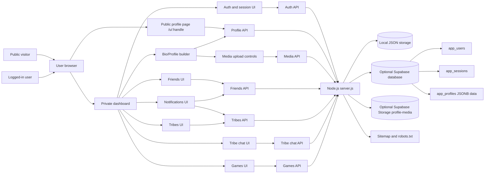
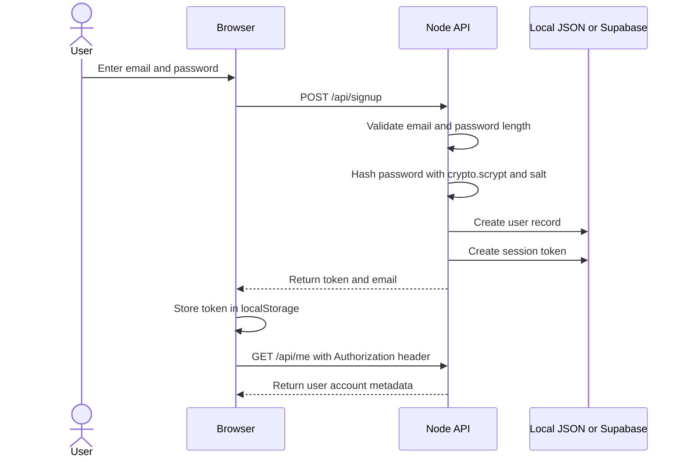
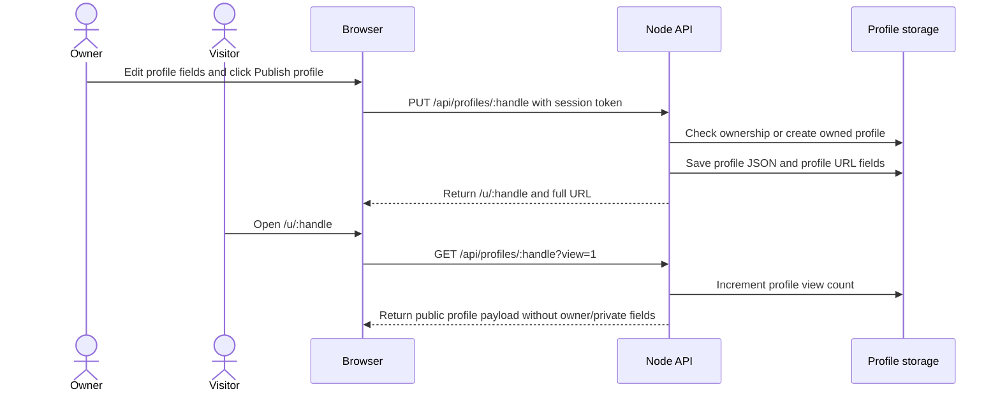
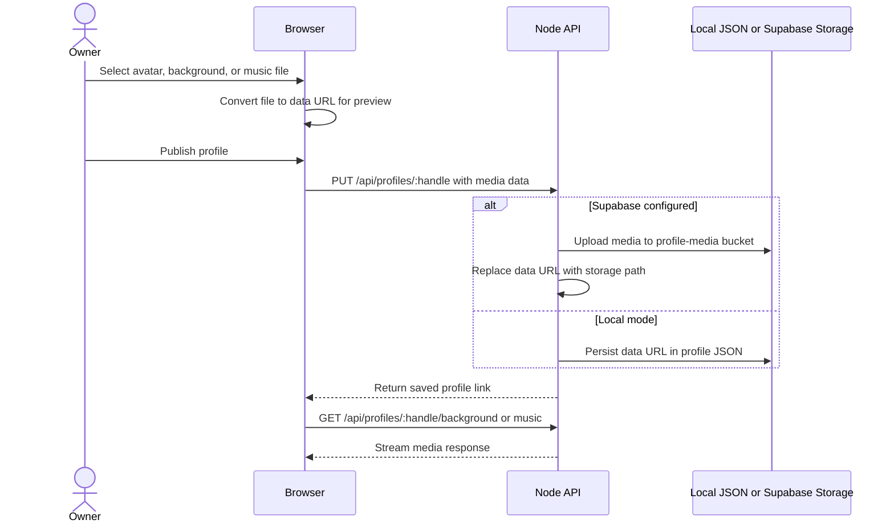
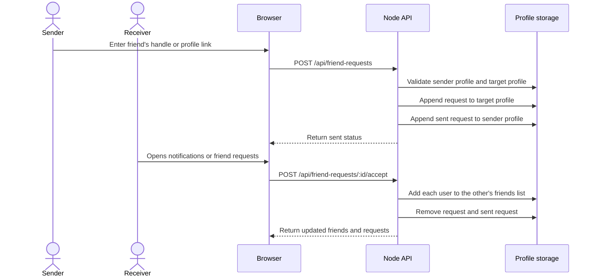
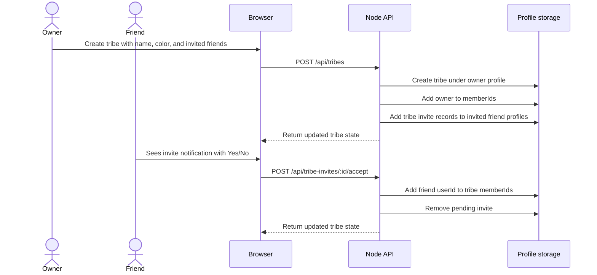
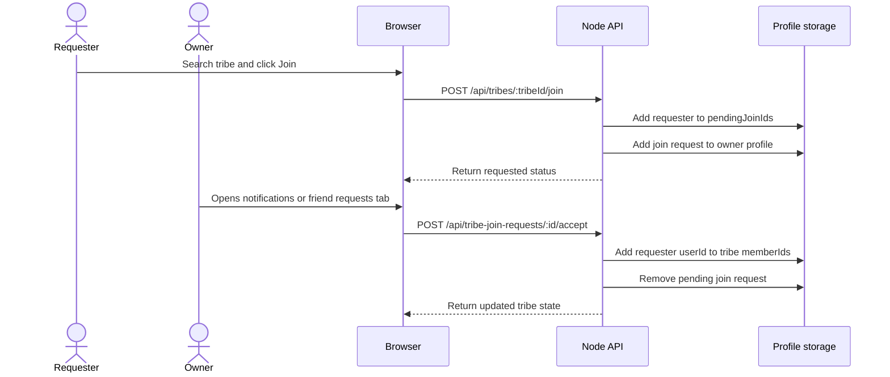
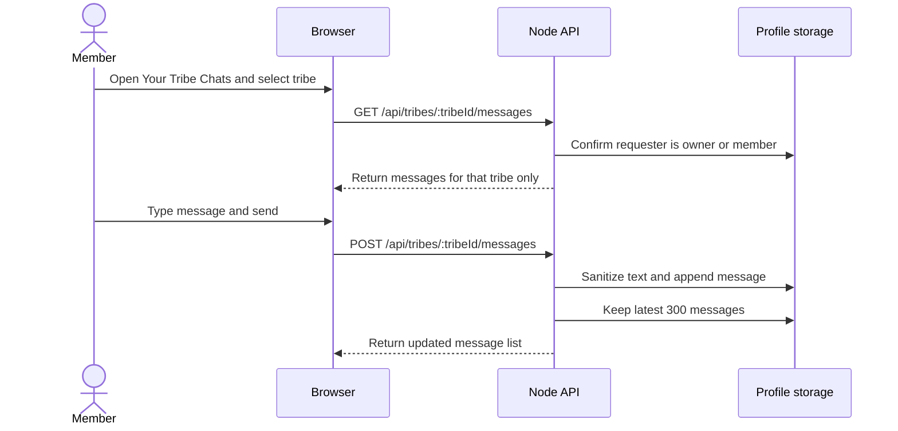
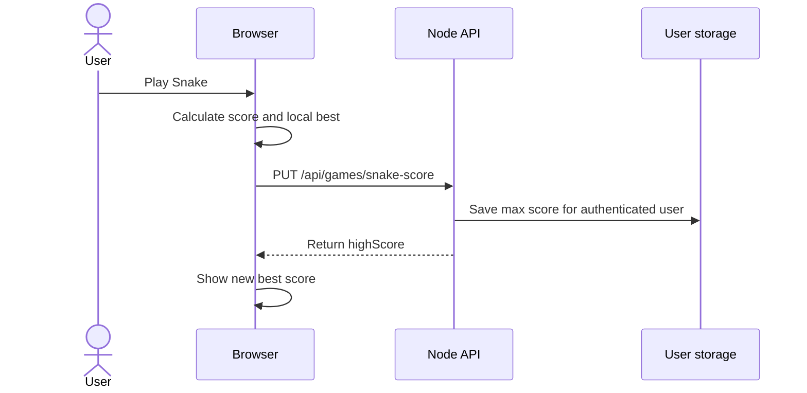
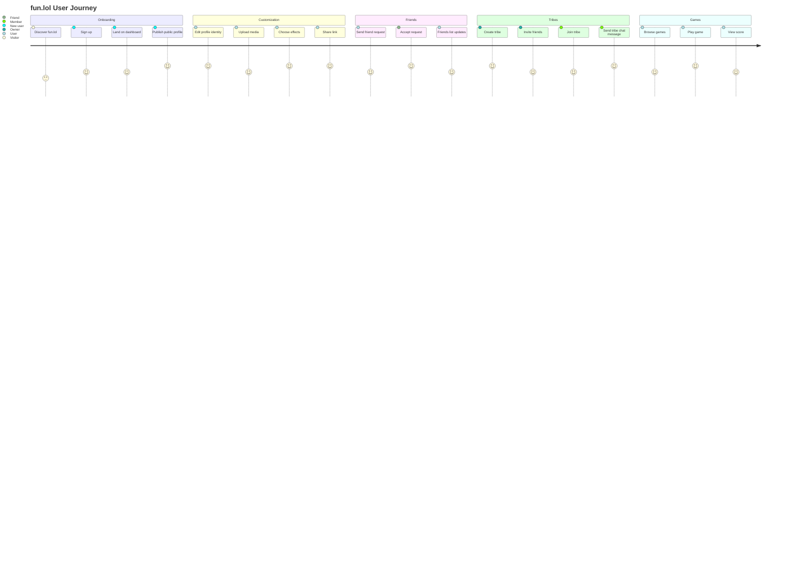

# fun.lol Product Documentation

Generated: 2026-05-24

This combined document includes the software architecture diagram document, product design document, and product journey map.

# Software Architecture Diagram Document

Generated: 2026-05-24

Source inspection scope: `index.html`, `script.js`, `styles.css`, `server.js`, `package.json`, and `supabase-schema.sql`.

## A. Architecture Overview

fun.lol is implemented as a lightweight single-page web application with a Node.js backend. The frontend is delivered from static files and switches between an authenticated dashboard, a bio/profile editor, public profile pages, games, friends, tribes, and tribe chats. The backend exposes JSON API routes for authentication, profile publishing, media delivery, friends, tribes, tribe chat, and the server-backed Snake score.

Confirmed implementation:

- Frontend files: `index.html`, `script.js`, and `styles.css`.
- Backend entry point: `server.js`, using Node's built-in `http` module rather than Express or another framework.
- Static routing: `/` serves `index.html`; `/u/:handle` also serves `index.html` so the client can load a public profile by handle.
- API routing: `/api/...` routes are handled directly in `server.js`.
- Local persistence fallback: `data/users.json` and `data/profiles.json`.
- Optional Supabase persistence: enabled when `SUPABASE_URL` and `SUPABASE_SERVICE_ROLE_KEY` are present.
- Supabase tables currently defined in `supabase-schema.sql`: `app_users`, `app_sessions`, and `app_profiles`.
- Supabase Storage bucket used by the server when configured: `profile-media`.
- Public discovery support: `/robots.txt` and `/sitemap.xml`.

Storage model:

- In local mode, users and sessions are stored in `data/users.json`; profiles and most social features are stored in `data/profiles.json`.
- In Supabase mode, users are stored in `app_users`, sessions in `app_sessions`, and profile data in `app_profiles.data` as JSONB.
- Friends, friend requests, tribes, tribe invites, join requests, tribe messages, profile settings, media references, social links, and most profile customization data are logical entities currently nested inside profile JSON.
- Media files are stored as data URLs in profile JSON when Supabase is not configured. When Supabase is configured, uploaded avatar, background, and music files are moved into Supabase Storage and referenced by path.

### API Route Summary

| Area | Routes | Confirmed behavior |
|---|---|---|
| Authentication | `POST /api/signup`, `POST /api/login`, `GET /api/me` | Creates users, validates credentials, returns session token and account profile metadata. |
| Profile | `GET /api/my-profile`, `GET /api/profiles/:handle`, `PUT /api/profiles/:handle` | Loads owned profile, loads public profile, publishes profile changes. |
| Public media | `GET /api/profiles/:handle/avatar`, `/background`, `/music` | Delivers uploaded media from Supabase Storage path or local data URL fallback. |
| Friends | `POST /api/friend-requests`, `POST /api/friend-requests/:id/accept`, `DELETE /api/friends/:key` | Sends, accepts, and removes friendships. |
| Tribes | `GET /api/tribes`, `POST /api/tribes`, `PATCH /api/tribes/:tribeId`, `DELETE /api/tribes/:tribeId` | Lists, creates, updates, and deletes tribes. |
| Tribe membership | `POST /api/tribes/:tribeId/join`, `POST /api/tribe-invites/:id/:action`, `POST /api/tribe-join-requests/:id/:action`, `DELETE /api/tribes/:tribeId/members/:memberId` | Handles invite, join, owner approval, decline, and member removal flows. |
| Tribe chat | `GET /api/tribes/:tribeId/messages`, `POST /api/tribes/:tribeId/messages` | Loads and appends messages for members only. |
| Games | `GET /api/games/snake-score`, `PUT /api/games/snake-score` | Saves the authenticated user's Snake high score. |
| SEO | `GET /robots.txt`, `GET /sitemap.xml` | Allows crawlers and lists the home page plus public profile URLs. |

## B. System Architecture Diagram



## C. Entity Relationship Diagram

This ERD documents the logical product model. Confirmed physical Supabase tables are `app_users`, `app_sessions`, and `app_profiles`; the other entities are currently represented inside profile JSON or derived from profile JSON.

```mermaid
erDiagram
  USER ||--o| PROFILE : owns
  USER ||--o{ ACCOUNT_SETTINGS : has
  PROFILE ||--o{ SOCIAL_LINK : contains
  PROFILE ||--o{ MEDIA_ASSET : references
  USER ||--o{ GAME_SCORE : earns
  USER ||--o{ FRIEND_REQUEST : sends
  USER ||--o{ FRIEND_REQUEST : receives
  USER ||--o{ FRIENDSHIP : participates
  USER ||--o{ NOTIFICATION : receives
  USER ||--o{ TRIBE : owns
  TRIBE ||--o{ TRIBE_MEMBER : includes
  TRIBE ||--o{ TRIBE_INVITE : sends
  TRIBE ||--o{ TRIBE_JOIN_REQUEST : receives
  TRIBE ||--o{ TRIBE_MESSAGE : contains
  USER ||--o{ TRIBE_MESSAGE : sends

  USER {{
    string id
    string email
    string password_hash
    string profile_handle
    string profile_path
    string profile_url
    integer snake_high_score
    datetime created_at
  }}

  PROFILE {{
    string handle
    string owner_user_id
    integer views
    string name
    string bio
    string location
    string theme
    boolean compactLinks
    boolean animatedBackground
    boolean darkVideo
    boolean cursorTrail
    string cursorColor
    string sparkleEffect
    datetime updatedAt
  }}

  SOCIAL_LINK {{
    string platform
    string value
    string normalized_url
  }}

  FRIEND_REQUEST {{
    string id
    string fromName
    string fromHandle
    string fromLink
    datetime createdAt
  }}

  FRIENDSHIP {{
    string id
    string name
    string handle
    string link
  }}

  NOTIFICATION {{
    string id
    string type
    string title
    string actorHandle
    datetime createdAt
  }}

  TRIBE {{
    string tribeId
    string name
    string ownerId
    string ownerDisplayName
    string ownerHandle
    string themeColor
    datetime createdAt
    datetime updatedAt
  }}

  TRIBE_MEMBER {{
    string tribeId
    string userId
    string displayName
    string handle
    string link
  }}

  TRIBE_INVITE {{
    string id
    string tribeId
    string tribeName
    string ownerId
    string ownerDisplayName
    string ownerHandle
    datetime createdAt
  }}

  TRIBE_JOIN_REQUEST {{
    string id
    string tribeId
    string tribeName
    string requesterId
    string requesterDisplayName
    string requesterHandle
    datetime createdAt
  }}

  TRIBE_MESSAGE {{
    string id
    string senderId
    string senderDisplayName
    string senderHandle
    string text
    datetime createdAt
  }}

  GAME_SCORE {{
    string userId
    string game
    integer highScore
    datetime updatedAt
  }}

  MEDIA_ASSET {{
    string ownerUserId
    string handle
    string field
    string mimeType
    string storagePath
    string fileName
  }}

  ACCOUNT_SETTINGS {{
    string userId
    string dashboardTheme
    string cursorMode
    string cursorColor
    boolean muteOutsideBio
    boolean sidebarCollapsed
  }}
```

## D. Sequence Diagrams

### 1. User Sign Up and Login



### 2. Public Profile Publishing and Viewing



### 3. Upload Profile, Background, or Music Media



### 4. Send and Accept Friend Request



### 5. Create Tribe and Invite Friends



### 6. Request to Join Tribe and Owner Approval



### 7. Open Tribe Chat and Send Message



### 8. Save Game Score



## E. Data Flow Summary

Authentication/session flow:

- The browser submits credentials to `POST /api/signup` or `POST /api/login`.
- The server validates inputs, hashes or verifies the password, creates a random session token, and returns it.
- The browser stores the token in localStorage and sends it in the `Authorization: Bearer` header.
- The server resolves the token through local JSON or Supabase sessions.

Profile update flow:

- The profile editor collects display name, handle, bio, location, social links, theme, cursor, sparkle, media, and toggle settings.
- The browser sends the profile payload to `PUT /api/profiles/:handle`.
- The server verifies the session and profile ownership before saving.
- Public profile links are saved back onto the user record when possible.

Media upload flow:

- The frontend previews selected files as data URLs.
- In Supabase mode, the server uploads media to `profile-media` and stores object paths.
- In local JSON mode, media remains embedded in profile JSON.
- Public profile media is served through `/api/profiles/:handle/avatar`, `/background`, and `/music`.

Friends/notifications flow:

- Friend requests are stored on the target profile and sent request state is stored on the sender profile.
- Notifications are rendered from friend requests, tribe invites, and tribe join requests.
- The frontend refreshes friend and notification state periodically.

Tribes flow:

- Tribes are owned by the creator and stored inside the owner's profile JSON.
- Tribe summaries are built by scanning all profiles and normalizing their tribe arrays.
- Owner-only actions are enforced by comparing the authenticated user ID with `tribe.ownerId`.

Tribe chat flow:

- Tribe messages are scoped by `tribeId`.
- Messages are stored inside the tribe object and capped at the latest 300 messages.
- Access is limited to the owner or member IDs.

Games score flow:

- Snake has server-backed high score storage.
- Click Rush and Crossy Road use localStorage best scores in the frontend.
- Wordle validates guesses against `words-5.txt` with a fallback word list.

## F. Security & Permissions

Confirmed controls:

- Passwords are hashed with Node `crypto.scrypt` and a random salt.
- Session tokens are generated with `crypto.randomBytes`.
- Private dashboard APIs require a valid bearer token.
- Profile publishing requires authentication.
- Existing profile ownership is enforced by `ownerUserId`.
- Public profile reads return a public payload and remove owner/private fields.
- Public profile view increments happen only when `?view=1` is used.
- Tribe edit, delete, and member removal require tribe ownership.
- Tribe chat access requires the requester to be the owner or a member.
- The owner cannot remove themselves from their tribe through the member removal endpoint.
- Supabase service role key is used only on the server.

Assumptions and limitations:

- Session expiration is not visible in the current implementation.
- Password reset and email verification are not implemented.
- Uploaded media validation is based on accepted frontend file types and server MIME handling; deeper scanning is not implemented.
- Rate limiting is not implemented.
- Realtime authorization is not applicable because chat is currently request/response, not WebSocket-based.

## G. Scalability Recommendations

- Move production persistence fully to Supabase instead of local JSON.
- Normalize high-volume entities into first-class tables: friendships, friend requests, tribes, tribe members, tribe messages, notifications, and media assets.
- Add database indexes for profile handle, owner user ID, tribe name search, tribe membership, and message timestamps.
- Add Supabase Row Level Security or equivalent API authorization policies if direct client access is ever introduced.
- Add session expiration, refresh, logout invalidation, and device/session management.
- Add rate limiting for auth, profile publishing, media uploads, friend requests, tribe joins, and chat messages.
- Add file size limits, content-type verification, media compression, and lifecycle cleanup for replaced media.
- Move tribe chat to Supabase Realtime or WebSockets when live chat behavior is required.
- Add audit logs for owner actions such as deleting tribes, removing members, and changing tribe settings.
- Add moderation workflows for public profiles, tribe names, chat messages, and uploaded media.
- Add structured API route modules as the backend grows beyond the current single-file server.

# Product Design Document

Generated: 2026-05-24

Source inspection scope: `index.html`, `script.js`, `styles.css`, `server.js`, `package.json`, and `supabase-schema.sql`.

## 1. Executive Summary

fun.lol is a customizable public profile platform where users can create a public bio page, add visual and audio media, connect with friends, join tribes, chat with tribe members, and play mini-games from a private dashboard. The current product blends a personal identity page with lightweight social and entertainment features.

## 2. Product Vision

The long-term vision is for fun.lol to become a highly personalized social identity hub. Users should be able to express themselves through media-rich profiles, share one public link, keep up with friends, create small communities, and enjoy interactive experiences without leaving the platform.

## 3. Target Users

- Creators who want a personalized profile link.
- Gamers who enjoy expressive profiles and mini-games.
- Social users who want a lightweight friend graph.
- Friend groups who want private-ish spaces around shared identity.
- Community or tribe members who want a shared group and chat.
- Public visitors who open a user's profile link.

## 4. Problem Statement

Many profile-link tools are static, generic, and disconnected from the user's actual social experience. fun.lol solves this by combining profile customization, media, friend requests, tribe communities, tribe chats, and mini-games in one lightweight web platform.

## 5. Product Goals

- Enable personal profile customization.
- Support public profile sharing by handle.
- Make social discovery and friend connection simple.
- Provide tribe/community engagement.
- Add mini-game entertainment inside the dashboard.
- Preserve a strong dark, animated, profile-first brand feel.

## 6. Non-Goals

The current version does not include:

- A full social media feed.
- Payment or subscription systems.
- Advanced moderation dashboard.
- Native mobile app.
- Enterprise admin portal.
- End-to-end encrypted messaging.
- Realtime chat infrastructure.
- Password reset or email verification.

## 7. Key Features

### Account & Authentication

- Email and password sign up.
- Login with saved browser session.
- Auto-login for returning users.
- Server-side password hashing.
- Settings page with account and public profile details.

### Dashboard

- Private logged-in home screen.
- Sidebar navigation for Bio, Games, Tribes, and Settings.
- Collapsible sidebar.
- Friends and notifications widgets.
- Dashboard theme selector.
- Pointer style and color controls.
- Mute Outside Bio control.

### Bio/Profile Builder

- Editable display name, handle, bio, and location.
- Public profile publishing.
- Visitor preview.
- Public link generation.
- Profile view counter.
- Profile card with avatar, UID, featured section, location, views, and social buttons.

### Profile Customization

- Avatar upload.
- Background image or video upload.
- Background music upload.
- Remove background and music files.
- Theme selection.
- Animated background, compact links, and dark video overlay toggles.
- Dot cursor, cursor color, and sparkle effects.

### Music & Entry Experience

- Public profile entry screen before the profile opens.
- Music starts after user interaction.
- Music controls on the owner's bio editor.
- Public visitors do not see the full music information box.
- Public video loop transition with audio fade behavior.

### Social Links

- Discord, Instagram, TikTok, YouTube, X, and GitHub social fields.
- Profile social output uses icons rather than plain text labels.

### Friends & Notifications

- Add friends by name, handle, or profile link.
- Send and accept friend requests.
- Remove friends after confirmation.
- View sent friend requests.
- Notifications widget and friend request tab.
- Periodic refresh of friend and notification state.

### Tribes

- Add Friends, Your Friends, Your Tribes, Join a Tribe, Your Tribe Chats, and Friend Requests tabs.
- Create tribes with a name and color.
- Invite friends to tribes.
- Accept or decline tribe invites.
- Search for tribes.
- Request to join tribes.
- Owner approval for join requests.
- Owner-only rename, color change, delete, and member removal.

### Tribe Chats

- Grid of chats for tribes the user can access.
- Open a selected tribe chat.
- Send messages scoped to that tribe.
- Exit chat back to the grid.
- Non-members are blocked by the backend.

### Games

- Games dashboard with card grid and expanded game views.
- Snake with server-backed high score.
- Click Rush with local best score.
- Wordle with English dictionary validation from `words-5.txt`.
- Crossy Road-style game with increasing difficulty and obstacles.
- Memory Match and Orbit Dodge placeholders.

### Backend/Data

- Node.js backend using built-in `http`.
- Local JSON fallback storage.
- Optional Supabase database support.
- Optional Supabase Storage media bucket.
- API routes for auth, profiles, friends, tribes, tribe chats, media, games, sitemap, and robots.

### Responsive UX

- Mobile layout adjustments.
- Custom cursor disabled on coarse pointer/mobile devices.
- Responsive dashboard/sidebar behavior.
- Glassmorphism dark UI.
- Animated star/void-style background.
- Hover movement effects.
- Loading, welcome, and entry transitions.

## 8. Functional Requirements

### Authentication

1. The system shall allow a user to sign up with email and password.
2. The system shall reject invalid emails and passwords shorter than the configured minimum.
3. The system shall hash passwords before storing them.
4. The system shall allow a user to log in with a valid email and password.
5. The system shall return a session token after successful signup or login.
6. The system shall load account metadata through `GET /api/me`.

### Dashboard

1. The system shall show the authenticated dashboard only after login.
2. The system shall provide Bio, Games, Tribes, and Settings navigation.
3. The system shall allow the sidebar to collapse and expand.
4. The system shall persist dashboard theme, cursor mode, cursor color, mute setting, and sidebar state in localStorage.
5. The system shall show friends and notifications widgets on the home screen.

### Profile Builder

1. The system shall allow users to edit name, handle, bio, and location.
2. The system shall normalize handles before publishing.
3. The system shall prevent authenticated users from editing profiles owned by another user.
4. The system shall generate `/u/:handle` public profile paths.
5. The system shall increment public views when a profile is opened with `?view=1`.

### Media

1. The system shall allow avatar, background, and music upload from the browser.
2. The system shall preview selected media before publish.
3. The system shall store media in Supabase Storage when Supabase is configured.
4. The system shall serve media through profile media API endpoints.
5. The system shall allow background and music files to be removed.

### Friends and Notifications

1. The system shall send friend requests to valid published profile handles.
2. The system shall prevent self friend requests.
3. The system shall prevent duplicate friendships from being added.
4. The system shall allow recipients to accept friend requests.
5. The system shall remove accepted requests from pending lists.
6. The system shall allow friends to be removed after confirmation.
7. The system shall refresh friend and notification state periodically.

### Tribes

1. The system shall allow authenticated profile owners to create tribes.
2. The system shall allow tribe owners to invite existing friends.
3. The system shall show tribe invites as notifications.
4. The system shall allow invited users to accept or decline.
5. The system shall allow users to search tribes by name.
6. The system shall allow users to request to join a tribe.
7. The system shall allow tribe owners to accept or decline join requests.
8. The system shall allow owners to rename tribes and change tribe color.
9. The system shall allow owners to delete tribes.
10. The system shall allow owners to remove members except themselves.

### Tribe Chats

1. The system shall show chat cards only for tribes the user owns or belongs to.
2. The system shall load messages for the selected tribe only.
3. The system shall reject chat access for non-members.
4. The system shall reject empty chat messages.
5. The system shall append sent messages to the selected tribe chat.
6. The system shall keep chat state when exiting back to the chat grid.

### Games

1. The system shall allow users to open games from a card grid.
2. The system shall expand the selected game and provide a return action.
3. The system shall show how-to-play content for each playable game.
4. The system shall save Snake high score through the backend.
5. The system shall save Click Rush and Crossy Road best scores locally.
6. The system shall validate Wordle guesses against a dictionary.

## 9. Non-Functional Requirements

Security:

- Passwords must be hashed before storage.
- Private APIs must require valid sessions.
- Owner-only actions must be checked on the server.

Performance:

- Public profiles should minimize payload size by avoiding inline media in public view mode when storage paths exist.
- Background videos should load without blocking core profile text.

Scalability:

- Production should use Supabase or another managed database instead of local JSON.
- High-volume data such as chat messages should move to dedicated tables.

Availability:

- The app can run locally with JSON storage and in hosted mode with Supabase.
- Recommendation: add backups and monitoring for production.

Responsiveness:

- Dashboard and profile layouts should adapt to mobile and desktop.
- Custom cursor effects should be disabled on coarse pointer devices.

Accessibility:

- Interactive controls should preserve labels or accessible names.
- Recommendation: add keyboard and screen reader audits for games and dialogs.

Maintainability:

- Recommendation: split the growing `server.js` and `script.js` into modules as the product grows.

Browser compatibility:

- The app should work in modern Chromium, Edge, Safari, and Firefox browsers.
- Recommendation: test media autoplay behavior across browsers because music requires user interaction.

Data privacy:

- Public profile payloads should not include password hashes, session tokens, or private owner fields.
- Recommendation: avoid exposing Supabase service keys to the client.

Error handling:

- API errors should return clear messages.
- UI should show toast or status messages for failed actions.

## 10. User Roles & Permissions

| Role | Description | Key permissions |
|---|---|---|
| Public visitor | Not logged in, opens a public profile | View public profile and media entry experience. |
| Logged-in user | Authenticated account holder | Access dashboard, publish own profile, use games, manage friends and tribes. |
| Friend | User connected through accepted friend request | Appears in friends list and can be invited to tribes. |
| Tribe member | User included in a tribe member list | View tribe details and access tribe chat. |
| Tribe owner | Creator/owner of a tribe | Rename, recolor, delete tribe, approve joins, remove members, access chat. |
| Invited user | User who received a tribe invite | Accept or decline the invite. |
| Join requester | User who requested tribe membership | Wait for owner approval; cannot access chat until accepted. |

## 11. UX/UI Principles

- Dark glassmorphism visual language.
- Animated star/void background as a core brand element.
- Compact dashboard layout with clear navigation.
- Profile-first personalization with live preview behavior.
- Smooth loading, welcome, and entry transitions.
- Game-like interaction patterns for cards, hover motion, and cursor effects.
- Mobile-friendly behavior with custom cursor effects disabled where inappropriate.

## 12. Data Model

| Object | Key fields | Current persistence |
|---|---|---|
| User | id, email, passwordHash/password_hash, profileHandle, profilePath, profileUrl, snakeHighScore | `users.json` or `app_users`. |
| Profile | handle, ownerUserId, name, bio, location, theme, views, updatedAt | `profiles.json` or `app_profiles.data`. |
| AccountSettings | dashboardTheme, cursorMode, cursorColor, muteOutsideBio, sidebarCollapsed | Browser localStorage. |
| SocialLink | platform, value, normalizedUrl | Profile JSON. |
| FriendRequest | id, fromName, fromHandle, fromLink, createdAt | Target profile JSON. |
| Friendship | id, name, handle, link | Profile JSON. |
| Notification | derived type, actor, target, createdAt | Derived from friend requests, tribe invites, and join requests. |
| Tribe | tribeId, name, ownerId, ownerDisplayName, ownerHandle, memberIds, pendingInviteIds, pendingJoinIds, themeColor, messages, createdAt, updatedAt | Owner profile JSON. |
| TribeMember | userId, displayName, handle, link | Derived from memberIds and profile data. |
| TribeInvite | id, tribeId, tribeName, ownerId, ownerDisplayName, ownerHandle, createdAt | Invited user's profile JSON. |
| TribeJoinRequest | id, tribeId, tribeName, requesterId, requesterDisplayName, requesterHandle, createdAt | Owner profile JSON. |
| TribeMessage | id, senderId, senderDisplayName, senderHandle, text, createdAt | Tribe object in owner profile JSON. |
| GameScore | userId, game, highScore | Snake in user storage; other best scores in localStorage. |
| MediaAsset | avatar/background/music data or path, name, type | Profile JSON plus optional Supabase Storage object. |

## 13. Key User Flows

- Sign up: User enters email/password, server creates account and session, dashboard loads.
- Login: User enters credentials, server verifies password, session token is stored.
- Edit bio profile: User changes profile fields, preview updates, user publishes.
- Upload media: User selects avatar/background/music, preview updates, profile publish stores media.
- Publish public profile: Server saves profile and returns `/u/:handle`.
- Visitor opens profile: Visitor enters profile page, view count increments, public profile loads.
- Add friend: User enters a handle/link, server sends request to target profile.
- Accept friend request: Recipient accepts, both friend lists update.
- Create tribe: Owner creates tribe, optionally invites friends.
- Invite friend to tribe: Friend receives tribe invite notification and accepts/declines.
- Join tribe: User searches tribe and sends join request.
- Approve join request: Owner accepts requester into member list.
- Open tribe chat: Member selects chat card and loads scoped messages.
- Send tribe message: Member sends non-empty text, message is appended to tribe.
- Play game: User opens game, plays, game-over state shows score.
- Save score: Snake score saves through backend; selected other games use localStorage.
- Change dashboard/theme/cursor settings: User changes controls and settings persist locally.

## 14. Edge Cases

- Duplicate handle: Server rejects editing a profile owned by another account.
- Invalid profile link: Friend request route returns an error for invalid target handles.
- Failed media upload: Server returns an error and profile publish should show a failure message.
- Removed background/music file: UI clears local state and publish persists removal.
- Empty bio fields: Defaults are applied for name, handle, bio, and location.
- Friend already added: Existing friendship prevents duplicate request behavior.
- Duplicate friend request: Existing pending request is reused.
- Tribe already exists: Current implementation does not enforce unique tribe names. Recommendation: add duplicate-name handling per owner.
- User already in tribe: Join route returns joined status.
- User already invited: Duplicate invite records are avoided.
- Non-member accessing tribe chat: Server returns a forbidden error.
- Owner removing themselves: Server rejects removing the owner.
- Tribe deleted while chat is open: Active chat is cleared when tribe state refresh removes access.
- Empty chat message: Server rejects empty sanitized text.
- Game score save failure: Snake falls back to local best-score behavior in the frontend.
- Local JSON storage unavailable: Server file read/write would fail. Recommendation: add operational monitoring and backups.
- Supabase unavailable: API requests will fail in Supabase mode. Recommendation: add retry and user-friendly status handling.

## 15. Acceptance Criteria

Authentication:

- A new user can sign up and reaches the dashboard.
- Existing users can log in without recreating accounts.
- Invalid credentials produce a clear error.

Dashboard:

- Sidebar navigation changes active sections.
- Sidebar collapse state persists.
- Cursor, theme, and mute controls do not overlap and remain clickable.

Profile:

- A user can publish a profile and receive a public link.
- Visitors can open `/u/:handle` without edit controls.
- View count increases when a public profile is viewed.

Media:

- Avatar, background, and music can be selected, previewed, saved, and loaded again.
- Remove buttons clear background and music.

Friends:

- A user can send a friend request by handle or profile link.
- Recipient can accept the request.
- Friends appear without requiring a full page refresh after periodic refresh.
- Removing a friend asks for confirmation.

Tribes:

- A user can create a tribe and invite friends.
- Invited users receive Yes/No notifications.
- Users can search and request to join tribes.
- Owners can approve join requests.
- Owners can rename, recolor, delete, and remove members.
- Non-owners do not see or use owner controls.

Tribe Chats:

- Members see chat cards for their tribes.
- Non-members cannot open a tribe chat.
- Messages are scoped to the active tribe.
- Exit Chat returns to the chat grid.

Games:

- Playable games open from the grid.
- Snake, Click Rush, Wordle, and Crossy Road show game-over states.
- Wordle rejects guesses not found in the dictionary.
- Snake high score is saved for the authenticated user.

## 16. Analytics & Success Metrics

- Signups.
- Logins and returning users.
- Published profiles.
- Public profile views.
- Media uploads.
- Profile publish success rate.
- Friend requests sent and accepted.
- Active friendships.
- Tribes created.
- Tribe invites accepted/declined.
- Tribe join requests accepted/declined.
- Tribe chat messages sent.
- Games opened.
- Games completed.
- Snake high score saves.
- Theme/cursor customization usage.

## 17. Risks & Mitigations

| Risk | Type | Mitigation |
|---|---|---|
| Local JSON storage may not scale | Technical | Move production data to Supabase tables and add backups. |
| Chat stored inside owner profile JSON can become large | Technical | Move messages to a dedicated messages table or realtime service. |
| No session expiration visible | Security | Add token expiry, refresh, and logout invalidation. |
| Public media may be large | Performance | Add upload limits, compression, and CDN-backed storage. |
| User-generated content can be abusive | Product/Safety | Add reporting, moderation, block lists, and content rules. |
| Music/video autoplay varies by browser | UX | Keep entry gate and test browser-specific media behavior. |
| Large `script.js` and `server.js` reduce maintainability | Engineering | Split by feature modules and add automated tests. |

## 18. Future Enhancements

- Realtime tribe chat.
- Push notifications.
- Image/audio attachments in chat.
- Tribe privacy controls.
- Moderation tools and report flows.
- Profile templates.
- More games.
- Public tribe discovery.
- Supabase-first production database with normalized social tables.
- Mobile app.
- Premium customization features.
- Password reset and email verification.
- Admin analytics dashboard.

# Product Journey Map

Generated: 2026-05-24

Source inspection scope: `index.html`, `script.js`, `styles.css`, `server.js`, `package.json`, and `supabase-schema.sql`.

## Journey 1: New User Onboarding

| Stage | User Goal | User Action | System Response | User Emotion | Pain Point | Opportunity / Improvement | Success Metric |
|---|---|---|---|---|---|---|---|
| Discover fun.lol | Understand what the platform does | Opens the site | Shows auth screen with profile creation message | Curious | Value proposition may depend on seeing examples | Add optional public demo profiles or sample preview | Landing-to-signup conversion |
| Sign up | Create an account | Enters email and password | Server creates user and session | Hopeful | Password rules are basic | Add inline password guidance | Signup completion rate |
| Login | Access account | Enters credentials | Server verifies password and returns token | Relieved | No password reset in current version | Add reset flow and email verification | Login success rate |
| Land on dashboard | Know where to start | Arrives at dashboard home | Shows welcome, friends widget, notifications widget, controls | Oriented | New users may not know Bio is first step | Add first-run checklist | Bio editor open rate |
| Explore sidebar | Navigate features | Clicks Bio, Games, Tribes, Settings | Dashboard switches panels | Interested | Mobile navigation can feel dense | Add onboarding hints and responsive polish | Sidebar engagement |
| Start editing bio | Build identity | Opens Bio editor | Shows profile card and editing forms | Creative | Long editor can feel complex | Group fields and offer templates | First profile edit rate |
| Publish public profile | Share identity | Clicks Publish profile | Server saves profile and returns public link | Accomplished | Handle conflicts can block publish | Add handle availability check | Published profiles |

## Journey 2: Profile Customization

| Stage | User Goal | User Action | System Response | User Emotion | Pain Point | Opportunity / Improvement | Success Metric |
|---|---|---|---|---|---|---|---|
| Edit display name/handle | Personalize identity | Types name and handle | Preview updates and publish payload changes | In control | Duplicate handles are found on publish | Add live handle validation | Successful handle saves |
| Add bio/location | Add context | Enters bio and location | Profile text updates | Expressive | Empty states use defaults | Add optional prompts | Bio completion rate |
| Upload avatar | Show personality | Selects image | Avatar preview updates | Excited | Large image may slow save | Add image compression | Avatar upload count |
| Upload background image/video | Make page immersive | Selects media file | Background preview updates | Impressed | Large videos can load slowly | Add file size guidance and compression | Background upload count |
| Upload music | Add sound | Selects audio file | Music player becomes available | Playful | Browser requires interaction before playback | Keep entry gate and explain only when needed | Music upload count |
| Choose theme/cursor/sparkle effects | Tune style | Selects theme, cursor, color, sparkle | UI updates immediately | Creative | Many controls can crowd UI | Keep separate control groups | Customization usage |
| Preview profile | See visitor view | Clicks visitor preview | Edit controls hide for preview | Confident | Preview can differ from public media behavior | Add public-preview checklist | Preview usage |
| Share public profile link | Bring visitors | Copies or opens `/u/:handle` | Public page loads and increments views | Proud | Sharing depends on remembering link | Add share buttons | Profile views |

## Journey 3: Friends & Notifications

| Stage | User Goal | User Action | System Response | User Emotion | Pain Point | Opportunity / Improvement | Success Metric |
|---|---|---|---|---|---|---|---|
| Search for friend | Find someone | Enters friend handle or profile link | Form validates target after submit | Focused | No full people search yet | Add user search and suggestions | Friend search attempts |
| Send request | Connect | Submits friend request | Target profile receives request; sender sees sent state | Hopeful | Invalid handle creates failure | Add autocomplete | Requests sent |
| Friend receives notification | Notice incoming request | Opens dashboard | Notification widget and request tab show request | Aware | Notifications are pull-based | Add realtime or push notifications | Request open rate |
| Friend accepts | Confirm connection | Clicks accept | Both friend lists update | Satisfied | Decline flow is not as prominent as accept | Add clearer action states | Acceptance rate |
| Friends list updates | See current network | Waits or navigates | Frontend refreshes about every 10 seconds | Reassured | Delay may feel slow | Use realtime subscriptions later | Refresh success rate |
| Remove friend if needed | Control network | Clicks remove | Confirmation dialog appears; friendship removed if confirmed | Safe | Mistakes are possible | Keep confirmation and add undo later | Friend removals |

## Journey 4: Tribes & Tribe Chats

| Stage | User Goal | User Action | System Response | User Emotion | Pain Point | Opportunity / Improvement | Success Metric |
|---|---|---|---|---|---|---|---|
| Open Tribes section | Manage community | Clicks Tribes | Shows top tabs for friends, tribes, join, chats, requests | Curious | Many tabs can feel dense | Add clearer grouping or icons | Tribes tab visits |
| View friends/tribes tabs | Understand options | Switches tabs | Shows relevant list panels | Oriented | Empty states need guidance | Add next-action empty states | Tab engagement |
| Create tribe | Start a group | Enters name, color, invited friends | Server creates tribe under owner profile | Proud | Tribe names are not globally unique | Add owner-level or global uniqueness rules | Tribes created |
| Invite friends | Grow tribe | Selects friends during creation | Invited users receive tribe invite notification | Social | Invites require existing friendship | Add invite by profile handle later | Invites sent |
| Friend accepts tribe invite | Join group | Clicks Yes | User is added to memberIds | Included | Declined state is simply removed | Add owner-facing invite status | Invite acceptance rate |
| Search/join tribe | Discover groups | Searches and clicks Join | Owner receives join request | Interested | No public tribe categories | Add discovery filters | Join requests |
| Owner approves join request | Manage access | Clicks accept | Requester becomes member | Responsible | Owner must check notifications manually | Add notification badge improvements | Join approval rate |
| Open Your Tribe Chats | Chat with group | Clicks chat tab | Shows accessible tribe chat cards | Connected | No realtime updates | Add realtime chat | Chat opens |
| Select tribe chat grid card | Focus conversation | Clicks tribe card | Loads only that tribe messages | Engaged | Messages are capped but not searchable | Add search later | Messages loaded |
| Send message | Participate | Enters text and sends | Message appends to active tribe chat | Social | Text-only messages | Add attachments and reactions | Messages sent |
| Exit chat | Return to overview | Clicks Exit Chat | Returns to chat grid without deleting messages | In control | State may become stale | Refresh active chat periodically | Exit success |

## Journey 5: Games

| Stage | User Goal | User Action | System Response | User Emotion | Pain Point | Opportunity / Improvement | Success Metric |
|---|---|---|---|---|---|---|---|
| Open Games dashboard | Find entertainment | Clicks Games | Shows scrollable game grid | Playful | Coming-soon games may disappoint | Clearly label playable vs coming soon | Games tab visits |
| Browse game cards | Choose game | Scans cards | Cards show names and previews | Curious | Game previews could be more descriptive | Add short metadata on hover | Game card clicks |
| Expand game | Start focused play | Clicks game card | Selected game expands with controls | Excited | Large cards need responsive sizing | Continue mobile tuning | Game opens |
| Read how-to-play | Learn rules | Reads side help | Each game shows individual instructions | Prepared | Instructions may be missed | Keep help close to game area | Help visibility |
| Play game | Have fun | Uses mouse/keyboard | Game updates score and state | Focused | Keyboard controls vary by device | Add touch controls for mobile | Game starts |
| Save/view score | Track progress | Finishes game | Snake saves to backend; other games use local best | Competitive | Not all scores are server-backed | Add unified game score model | Score saves |
| Return to dashboard | Continue exploring | Clicks Back to games or sidebar | Returns to grid or dashboard | Satisfied | None major | Add recent games widget later | Repeat play rate |

## Mermaid User Journey Diagram



## Cross-Journey Recommendations

- Add first-run onboarding to guide new users toward publishing their first profile.
- Add live handle availability checks before publish.
- Add media size guidance before upload.
- Add realtime or near-realtime notifications for friend and tribe events.
- Add a unified server-backed score model for all games.
- Add moderation and reporting before scaling public discovery.
