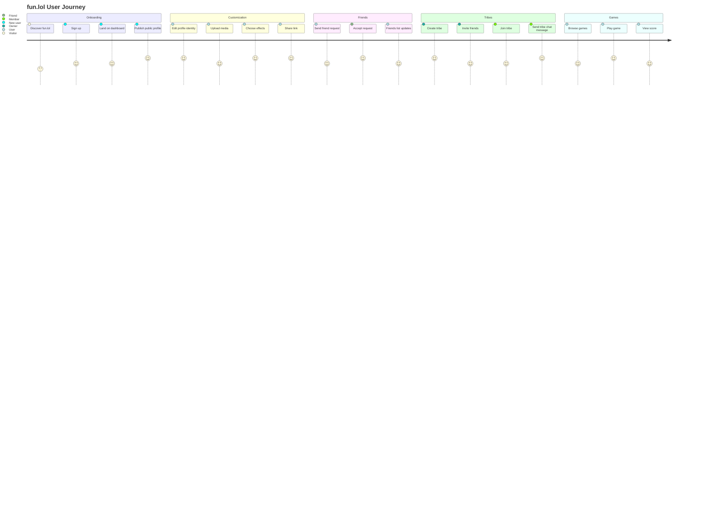

# fun.lol Product Journey Map

Generated: 2026-05-24

Source inspection scope: `index.html`, `script.js`, `styles.css`, `server.js`, `package.json`, and `supabase-schema.sql`.

## Journey 1: New User Onboarding

| Stage | User Goal | User Action | System Response | User Emotion | Pain Point | Opportunity / Improvement | Success Metric |
|---|---|---|---|---|---|---|---|
| Discover fun.lol | Understand what the platform does | Opens the site | Shows auth screen with profile creation message | Curious | Value proposition may depend on seeing examples | Add optional public demo profiles or sample preview | Landing-to-signup conversion |
| Sign up | Create an account | Enters email and password | Server creates user and session | Hopeful | Password rules are basic | Add inline password guidance | Signup completion rate |
| Login | Access account | Enters credentials | Server verifies password and returns token | Relieved | No password reset in current version | Add reset flow and email verification | Login success rate |
| Land on dashboard | Know where to start | Arrives at dashboard home | Shows welcome, friends widget, notifications widget, controls | Oriented | New users may not know Bio is first step | Add first-run checklist | Bio editor open rate |
| Explore sidebar | Navigate features | Clicks Bio, Games, Tribes, Settings | Dashboard switches panels | Interested | Mobile navigation can feel dense | Add onboarding hints and responsive polish | Sidebar engagement |
| Start editing bio | Build identity | Opens Bio editor | Shows profile card and editing forms | Creative | Long editor can feel complex | Group fields and offer templates | First profile edit rate |
| Publish public profile | Share identity | Clicks Publish profile | Server saves profile and returns public link | Accomplished | Handle conflicts can block publish | Add handle availability check | Published profiles |

## Journey 2: Profile Customization

| Stage | User Goal | User Action | System Response | User Emotion | Pain Point | Opportunity / Improvement | Success Metric |
|---|---|---|---|---|---|---|---|
| Edit display name/handle | Personalize identity | Types name and handle | Preview updates and publish payload changes | In control | Duplicate handles are found on publish | Add live handle validation | Successful handle saves |
| Add bio/location | Add context | Enters bio and location | Profile text updates | Expressive | Empty states use defaults | Add optional prompts | Bio completion rate |
| Upload avatar | Show personality | Selects image | Avatar preview updates | Excited | Large image may slow save | Add image compression | Avatar upload count |
| Upload background image/video | Make page immersive | Selects media file | Background preview updates | Impressed | Large videos can load slowly | Add file size guidance and compression | Background upload count |
| Upload music | Add sound | Selects audio file | Music player becomes available | Playful | Browser requires interaction before playback | Keep entry gate and explain only when needed | Music upload count |
| Choose theme/cursor/sparkle effects | Tune style | Selects theme, cursor, color, sparkle | UI updates immediately | Creative | Many controls can crowd UI | Keep separate control groups | Customization usage |
| Preview profile | See visitor view | Clicks visitor preview | Edit controls hide for preview | Confident | Preview can differ from public media behavior | Add public-preview checklist | Preview usage |
| Share public profile link | Bring visitors | Copies or opens `/u/:handle` | Public page loads and increments views | Proud | Sharing depends on remembering link | Add share buttons | Profile views |

## Journey 3: Friends & Notifications

| Stage | User Goal | User Action | System Response | User Emotion | Pain Point | Opportunity / Improvement | Success Metric |
|---|---|---|---|---|---|---|---|
| Search for friend | Find someone | Enters friend handle or profile link | Form validates target after submit | Focused | No full people search yet | Add user search and suggestions | Friend search attempts |
| Send request | Connect | Submits friend request | Target profile receives request; sender sees sent state | Hopeful | Invalid handle creates failure | Add autocomplete | Requests sent |
| Friend receives notification | Notice incoming request | Opens dashboard | Notification widget and request tab show request | Aware | Notifications are pull-based | Add realtime or push notifications | Request open rate |
| Friend accepts | Confirm connection | Clicks accept | Both friend lists update | Satisfied | Decline flow is not as prominent as accept | Add clearer action states | Acceptance rate |
| Friends list updates | See current network | Waits or navigates | Frontend refreshes about every 10 seconds | Reassured | Delay may feel slow | Use realtime subscriptions later | Refresh success rate |
| Remove friend if needed | Control network | Clicks remove | Confirmation dialog appears; friendship removed if confirmed | Safe | Mistakes are possible | Keep confirmation and add undo later | Friend removals |

## Journey 4: Tribes & Tribe Chats

| Stage | User Goal | User Action | System Response | User Emotion | Pain Point | Opportunity / Improvement | Success Metric |
|---|---|---|---|---|---|---|---|
| Open Tribes section | Manage community | Clicks Tribes | Shows top tabs for friends, tribes, join, chats, requests | Curious | Many tabs can feel dense | Add clearer grouping or icons | Tribes tab visits |
| View friends/tribes tabs | Understand options | Switches tabs | Shows relevant list panels | Oriented | Empty states need guidance | Add next-action empty states | Tab engagement |
| Create tribe | Start a group | Enters name, color, invited friends | Server creates tribe under owner profile | Proud | Tribe names are not globally unique | Add owner-level or global uniqueness rules | Tribes created |
| Invite friends | Grow tribe | Selects friends during creation | Invited users receive tribe invite notification | Social | Invites require existing friendship | Add invite by profile handle later | Invites sent |
| Friend accepts tribe invite | Join group | Clicks Yes | User is added to memberIds | Included | Declined state is simply removed | Add owner-facing invite status | Invite acceptance rate |
| Search/join tribe | Discover groups | Searches and clicks Join | Owner receives join request | Interested | No public tribe categories | Add discovery filters | Join requests |
| Owner approves join request | Manage access | Clicks accept | Requester becomes member | Responsible | Owner must check notifications manually | Add notification badge improvements | Join approval rate |
| Open Your Tribe Chats | Chat with group | Clicks chat tab | Shows accessible tribe chat cards | Connected | No realtime updates | Add realtime chat | Chat opens |
| Select tribe chat grid card | Focus conversation | Clicks tribe card | Loads only that tribe messages | Engaged | Messages are capped but not searchable | Add search later | Messages loaded |
| Send message | Participate | Enters text and sends | Message appends to active tribe chat | Social | Text-only messages | Add attachments and reactions | Messages sent |
| Exit chat | Return to overview | Clicks Exit Chat | Returns to chat grid without deleting messages | In control | State may become stale | Refresh active chat periodically | Exit success |

## Journey 5: Games

| Stage | User Goal | User Action | System Response | User Emotion | Pain Point | Opportunity / Improvement | Success Metric |
|---|---|---|---|---|---|---|---|
| Open Games dashboard | Find entertainment | Clicks Games | Shows scrollable game grid | Playful | Coming-soon games may disappoint | Clearly label playable vs coming soon | Games tab visits |
| Browse game cards | Choose game | Scans cards | Cards show names and previews | Curious | Game previews could be more descriptive | Add short metadata on hover | Game card clicks |
| Expand game | Start focused play | Clicks game card | Selected game expands with controls | Excited | Large cards need responsive sizing | Continue mobile tuning | Game opens |
| Read how-to-play | Learn rules | Reads side help | Each game shows individual instructions | Prepared | Instructions may be missed | Keep help close to game area | Help visibility |
| Play game | Have fun | Uses mouse/keyboard | Game updates score and state | Focused | Keyboard controls vary by device | Add touch controls for mobile | Game starts |
| Save/view score | Track progress | Finishes game | Snake saves to backend; other games use local best | Competitive | Not all scores are server-backed | Add unified game score model | Score saves |
| Return to dashboard | Continue exploring | Clicks Back to games or sidebar | Returns to grid or dashboard | Satisfied | None major | Add recent games widget later | Repeat play rate |

## Mermaid User Journey Diagram

## Cross-Journey Recommendations

- Add first-run onboarding to guide new users toward publishing their first profile.
- Add live handle availability checks before publish.
- Add media size guidance before upload.
- Add realtime or near-realtime notifications for friend and tribe events.
- Add a unified server-backed score model for all games.
- Add moderation and reporting before scaling public discovery.
