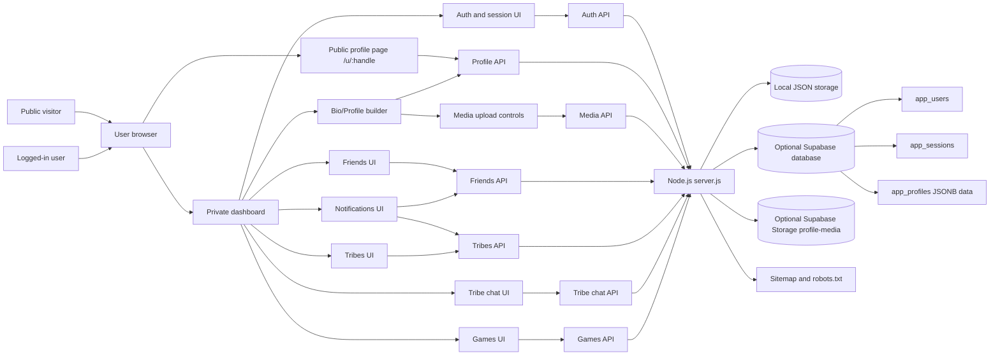
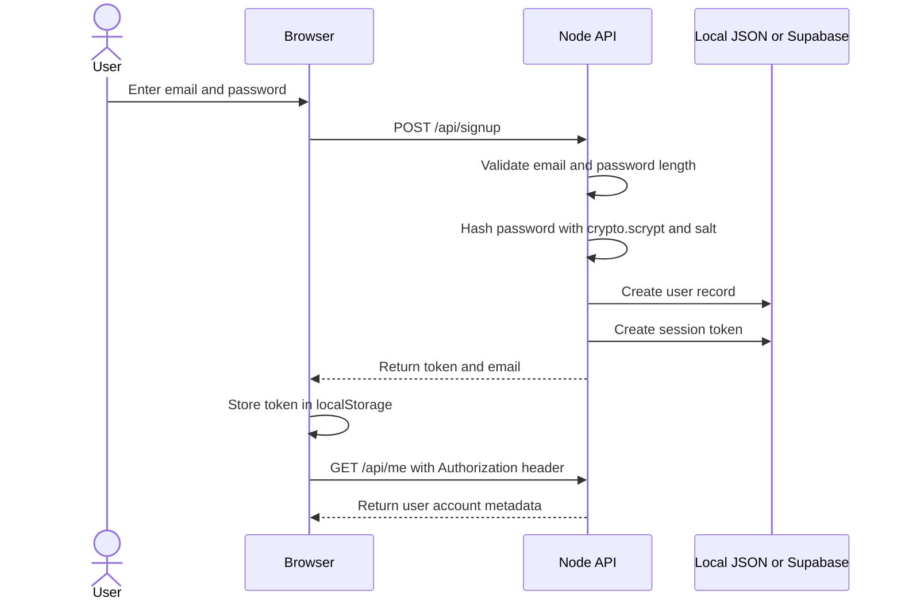
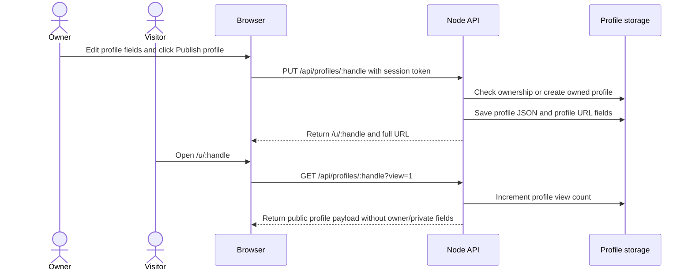
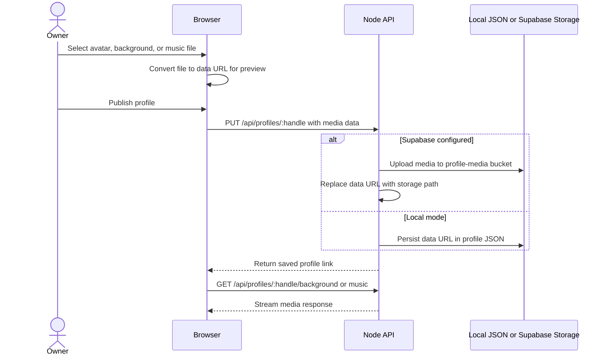
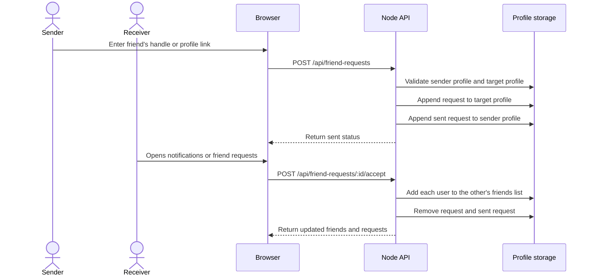
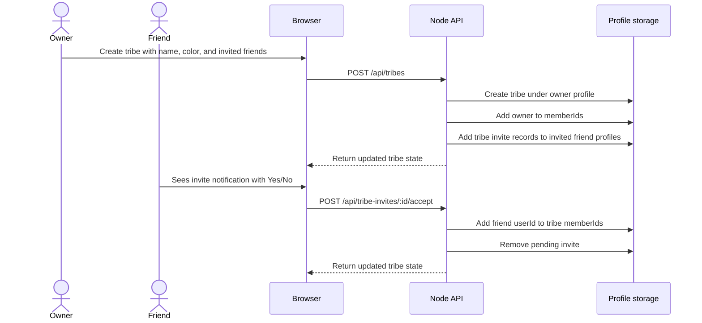
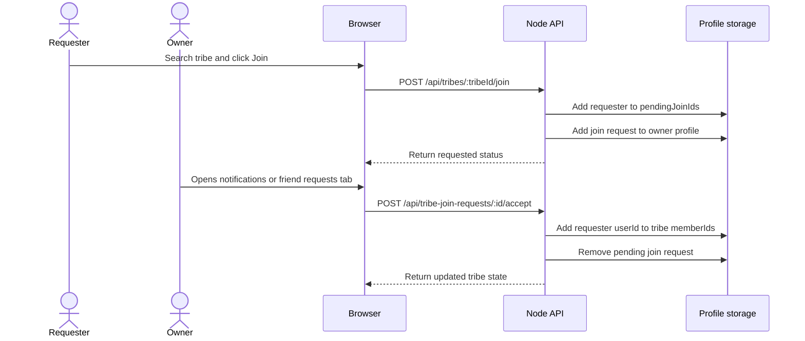
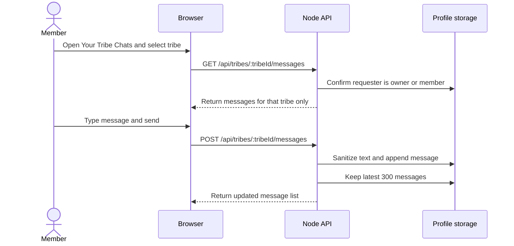
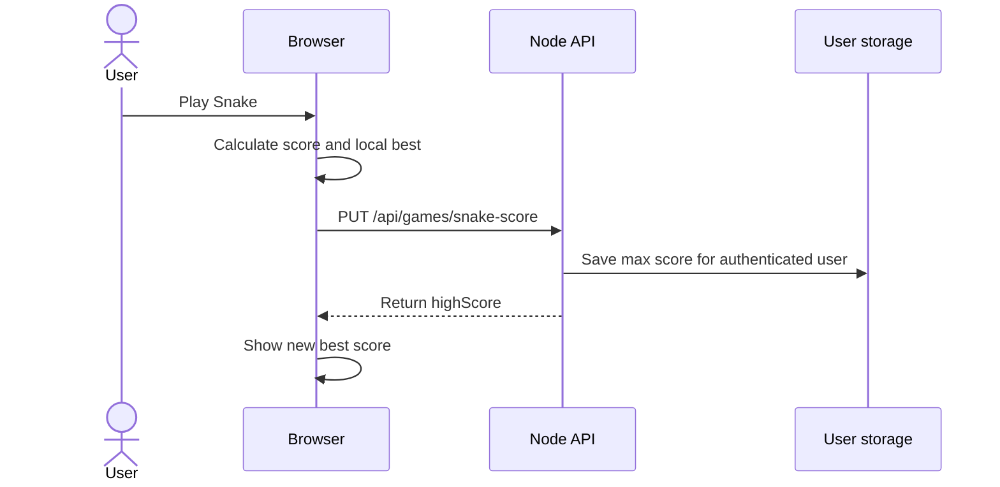

# fun.lol Software Architecture Diagram Document

Generated: 2026-05-24

Source inspection scope: `index.html`, `script.js`, `styles.css`, `server.js`, `package.json`, and `supabase-schema.sql`.

## A. Architecture Overview

fun.lol is implemented as a lightweight single-page web application with a Node.js backend. The frontend is delivered from static files and switches between an authenticated dashboard, a bio/profile editor, public profile pages, games, friends, tribes, and tribe chats. The backend exposes JSON API routes for authentication, profile publishing, media delivery, friends, tribes, tribe chat, and the server-backed Snake score.

Confirmed implementation:

- Frontend files: `index.html`, `script.js`, and `styles.css`.
- Backend entry point: `server.js`, using Node's built-in `http` module rather than Express or another framework.
- Static routing: `/` serves `index.html`; `/u/:handle` also serves `index.html` so the client can load a public profile by handle.
- API routing: `/api/...` routes are handled directly in `server.js`.
- Local persistence fallback: `data/users.json` and `data/profiles.json`.
- Optional Supabase persistence: enabled when `SUPABASE_URL` and `SUPABASE_SERVICE_ROLE_KEY` are present.
- Supabase tables currently defined in `supabase-schema.sql`: `app_users`, `app_sessions`, and `app_profiles`.
- Supabase Storage bucket used by the server when configured: `profile-media`.
- Public discovery support: `/robots.txt` and `/sitemap.xml`.

Storage model:

- In local mode, users and sessions are stored in `data/users.json`; profiles and most social features are stored in `data/profiles.json`.
- In Supabase mode, users are stored in `app_users`, sessions in `app_sessions`, and profile data in `app_profiles.data` as JSONB.
- Friends, friend requests, tribes, tribe invites, join requests, tribe messages, profile settings, media references, social links, and most profile customization data are logical entities currently nested inside profile JSON.
- Media files are stored as data URLs in profile JSON when Supabase is not configured. When Supabase is configured, uploaded avatar, background, and music files are moved into Supabase Storage and referenced by path.

### API Route Summary

| Area | Routes | Confirmed behavior |
|---|---|---|
| Authentication | `POST /api/signup`, `POST /api/login`, `GET /api/me` | Creates users, validates credentials, returns session token and account profile metadata. |
| Profile | `GET /api/my-profile`, `GET /api/profiles/:handle`, `PUT /api/profiles/:handle` | Loads owned profile, loads public profile, publishes profile changes. |
| Public media | `GET /api/profiles/:handle/avatar`, `/background`, `/music` | Delivers uploaded media from Supabase Storage path or local data URL fallback. |
| Friends | `POST /api/friend-requests`, `POST /api/friend-requests/:id/accept`, `DELETE /api/friends/:key` | Sends, accepts, and removes friendships. |
| Tribes | `GET /api/tribes`, `POST /api/tribes`, `PATCH /api/tribes/:tribeId`, `DELETE /api/tribes/:tribeId` | Lists, creates, updates, and deletes tribes. |
| Tribe membership | `POST /api/tribes/:tribeId/join`, `POST /api/tribe-invites/:id/:action`, `POST /api/tribe-join-requests/:id/:action`, `DELETE /api/tribes/:tribeId/members/:memberId` | Handles invite, join, owner approval, decline, and member removal flows. |
| Tribe chat | `GET /api/tribes/:tribeId/messages`, `POST /api/tribes/:tribeId/messages` | Loads and appends messages for members only. |
| Games | `GET /api/games/snake-score`, `PUT /api/games/snake-score` | Saves the authenticated user's Snake high score. |
| SEO | `GET /robots.txt`, `GET /sitemap.xml` | Allows crawlers and lists the home page plus public profile URLs. |

## B. System Architecture Diagram



## C. Entity Relationship Diagram

This ERD documents the logical product model. Confirmed physical Supabase tables are `app_users`, `app_sessions`, and `app_profiles`; the other entities are currently represented inside profile JSON or derived from profile JSON.

```mermaid
erDiagram
  USER ||--o| PROFILE : owns
  USER ||--o{ ACCOUNT_SETTINGS : has
  PROFILE ||--o{ SOCIAL_LINK : contains
  PROFILE ||--o{ MEDIA_ASSET : references
  USER ||--o{ GAME_SCORE : earns
  USER ||--o{ FRIEND_REQUEST : sends
  USER ||--o{ FRIEND_REQUEST : receives
  USER ||--o{ FRIENDSHIP : participates
  USER ||--o{ NOTIFICATION : receives
  USER ||--o{ TRIBE : owns
  TRIBE ||--o{ TRIBE_MEMBER : includes
  TRIBE ||--o{ TRIBE_INVITE : sends
  TRIBE ||--o{ TRIBE_JOIN_REQUEST : receives
  TRIBE ||--o{ TRIBE_MESSAGE : contains
  USER ||--o{ TRIBE_MESSAGE : sends

  USER {{
    string id
    string email
    string password_hash
    string profile_handle
    string profile_path
    string profile_url
    integer snake_high_score
    datetime created_at
  }}

  PROFILE {{
    string handle
    string owner_user_id
    integer views
    string name
    string bio
    string location
    string theme
    boolean compactLinks
    boolean animatedBackground
    boolean darkVideo
    boolean cursorTrail
    string cursorColor
    string sparkleEffect
    datetime updatedAt
  }}

  SOCIAL_LINK {{
    string platform
    string value
    string normalized_url
  }}

  FRIEND_REQUEST {{
    string id
    string fromName
    string fromHandle
    string fromLink
    datetime createdAt
  }}

  FRIENDSHIP {{
    string id
    string name
    string handle
    string link
  }}

  NOTIFICATION {{
    string id
    string type
    string title
    string actorHandle
    datetime createdAt
  }}

  TRIBE {{
    string tribeId
    string name
    string ownerId
    string ownerDisplayName
    string ownerHandle
    string themeColor
    datetime createdAt
    datetime updatedAt
  }}

  TRIBE_MEMBER {{
    string tribeId
    string userId
    string displayName
    string handle
    string link
  }}

  TRIBE_INVITE {{
    string id
    string tribeId
    string tribeName
    string ownerId
    string ownerDisplayName
    string ownerHandle
    datetime createdAt
  }}

  TRIBE_JOIN_REQUEST {{
    string id
    string tribeId
    string tribeName
    string requesterId
    string requesterDisplayName
    string requesterHandle
    datetime createdAt
  }}

  TRIBE_MESSAGE {{
    string id
    string senderId
    string senderDisplayName
    string senderHandle
    string text
    datetime createdAt
  }}

  GAME_SCORE {{
    string userId
    string game
    integer highScore
    datetime updatedAt
  }}

  MEDIA_ASSET {{
    string ownerUserId
    string handle
    string field
    string mimeType
    string storagePath
    string fileName
  }}

  ACCOUNT_SETTINGS {{
    string userId
    string dashboardTheme
    string cursorMode
    string cursorColor
    boolean muteOutsideBio
    boolean sidebarCollapsed
  }}
```

## D. Sequence Diagrams

### 1. User Sign Up and Login



### 2. Public Profile Publishing and Viewing



### 3. Upload Profile, Background, or Music Media



### 4. Send and Accept Friend Request



### 5. Create Tribe and Invite Friends



### 6. Request to Join Tribe and Owner Approval



### 7. Open Tribe Chat and Send Message



### 8. Save Game Score



## E. Data Flow Summary

Authentication/session flow:

- The browser submits credentials to `POST /api/signup` or `POST /api/login`.
- The server validates inputs, hashes or verifies the password, creates a random session token, and returns it.
- The browser stores the token in localStorage and sends it in the `Authorization: Bearer` header.
- The server resolves the token through local JSON or Supabase sessions.

Profile update flow:

- The profile editor collects display name, handle, bio, location, social links, theme, cursor, sparkle, media, and toggle settings.
- The browser sends the profile payload to `PUT /api/profiles/:handle`.
- The server verifies the session and profile ownership before saving.
- Public profile links are saved back onto the user record when possible.

Media upload flow:

- The frontend previews selected files as data URLs.
- In Supabase mode, the server uploads media to `profile-media` and stores object paths.
- In local JSON mode, media remains embedded in profile JSON.
- Public profile media is served through `/api/profiles/:handle/avatar`, `/background`, and `/music`.

Friends/notifications flow:

- Friend requests are stored on the target profile and sent request state is stored on the sender profile.
- Notifications are rendered from friend requests, tribe invites, and tribe join requests.
- The frontend refreshes friend and notification state periodically.

Tribes flow:

- Tribes are owned by the creator and stored inside the owner's profile JSON.
- Tribe summaries are built by scanning all profiles and normalizing their tribe arrays.
- Owner-only actions are enforced by comparing the authenticated user ID with `tribe.ownerId`.

Tribe chat flow:

- Tribe messages are scoped by `tribeId`.
- Messages are stored inside the tribe object and capped at the latest 300 messages.
- Access is limited to the owner or member IDs.

Games score flow:

- Snake has server-backed high score storage.
- Click Rush and Crossy Road use localStorage best scores in the frontend.
- Wordle validates guesses against `words-5.txt` with a fallback word list.

## F. Security & Permissions

Confirmed controls:

- Passwords are hashed with Node `crypto.scrypt` and a random salt.
- Session tokens are generated with `crypto.randomBytes`.
- Private dashboard APIs require a valid bearer token.
- Profile publishing requires authentication.
- Existing profile ownership is enforced by `ownerUserId`.
- Public profile reads return a public payload and remove owner/private fields.
- Public profile view increments happen only when `?view=1` is used.
- Tribe edit, delete, and member removal require tribe ownership.
- Tribe chat access requires the requester to be the owner or a member.
- The owner cannot remove themselves from their tribe through the member removal endpoint.
- Supabase service role key is used only on the server.

Assumptions and limitations:

- Session expiration is not visible in the current implementation.
- Password reset and email verification are not implemented.
- Uploaded media validation is based on accepted frontend file types and server MIME handling; deeper scanning is not implemented.
- Rate limiting is not implemented.
- Realtime authorization is not applicable because chat is currently request/response, not WebSocket-based.

## G. Scalability Recommendations

- Move production persistence fully to Supabase instead of local JSON.
- Normalize high-volume entities into first-class tables: friendships, friend requests, tribes, tribe members, tribe messages, notifications, and media assets.
- Add database indexes for profile handle, owner user ID, tribe name search, tribe membership, and message timestamps.
- Add Supabase Row Level Security or equivalent API authorization policies if direct client access is ever introduced.
- Add session expiration, refresh, logout invalidation, and device/session management.
- Add rate limiting for auth, profile publishing, media uploads, friend requests, tribe joins, and chat messages.
- Add file size limits, content-type verification, media compression, and lifecycle cleanup for replaced media.
- Move tribe chat to Supabase Realtime or WebSockets when live chat behavior is required.
- Add audit logs for owner actions such as deleting tribes, removing members, and changing tribe settings.
- Add moderation workflows for public profiles, tribe names, chat messages, and uploaded media.
- Add structured API route modules as the backend grows beyond the current single-file server.
